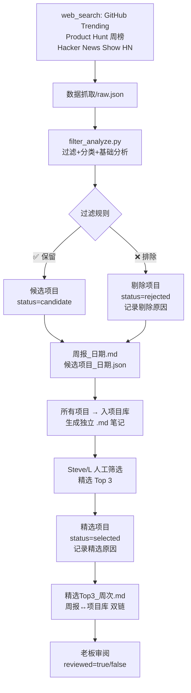

# 09_开源商机 — 开源商机监控系统

> 从 GitHub Trending / Product Hunt / Hacker News Show HN 发现商业化机会
> 自动化数据抓取（每周日 9:00 CST）+ 人工精选 Top 3

---

## 爬数据逻辑

每周日 9:00 CST，Cron 自动执行以下流程：



**数据源详情：**

| 数据源 | 频率 | 抓取方式 | 原始数量 |
|--------|------|----------|----------|
| GitHub Trending | 每周 | web_search + web_extract | ~20-25 个 |
| Product Hunt 周榜 | 每周 | web_search + web_extract | ~5-8 个 |
| Hacker News Show HN | 每周 | web_search + web_extract | ~5-8 个 |

**过滤规则（filter_analyze.py）：**

| ✅ 保留 | ❌ 排除 |
|---------|---------|
| AI+垂直场景（金融/健康/教育） | 编程语言/框架 |
| SaaS 替代品 | 论文复现 |
| 非开发者工具 | 纯 CLI 工具 |
| 数据/可视化 | 面向开发者的 infra |
| 内容创作工具 | 开发者工具/IDE |
| 生产力/消费者工具 | 开发者技能库/教学 |

---

## 目录结构

```
09_开源商机/
├── 开源商机数据库.md          # 索引+过滤规则+Dataview 查询
├── README.md                  # 本文件
├── 脚本/
│   └── filter_analyze.py      # Python 过滤+分类+分析引擎
├── 数据抓取/                  # 每周原始 JSON 数据
│   └── YYYY-MM-DD_raw.json
├── 周报归档/                  # 每周自动生成 + 人工精选
│   ├── 周报_YYYY-MM-DD.md     # 自动生成的完整候选列表
│   ├── 精选Top3_YYYY-Www.md   # 人工精选 Top 3
│   └── 候选项目_YYYY-MM-DD.json
└── 项目库/                    # 所有爬取项目（Obsidian Base 数据库）
    ├── {项目名}.md            # 每个项目独立笔记
    └── *.base                 # Obsidian Base 视图配置
```

---

## 项目库字段说明

项目库是 Obsidian Base 数据库，每个项目笔记的 YAML frontmatter 包含以下字段：

### 基本信息

| 字段 | 类型 | 说明 | 示例 |
|------|------|------|------|
| `name` | 文本 | 项目名 | `TradingAgents` |
| `source` | 选项 | 数据源 | `GitHub Trending` / `Product Hunt` / `Hacker News` |
| `url` | URL | 项目链接 | `https://github.com/...` |
| `stars` | 数字 | GitHub Stars 或 PH/HN 票数 | `59800` |
| `category` | 选项 | 项目分类 | `金融科技` / `AI + 内容创作` |
| `date` | 日期 | 抓取日期 | `2026-05-03` |

### 项目状态（核心分类）

| 字段 | 类型 | 说明 | 可选值 |
|------|------|------|--------|
| `status` | 选项 | 项目在管线中的状态 | `candidate`（候选） / `selected`（精选） / `rejected`（剔除） |
| `select_reason` | 文本 | 精选原因，仅 `status=selected` 时填写 | 为什么选它（增长、差异化、市场机会等） |
| `reject_reason` | 文本 | 剔除原因，仅 `status=rejected` 时填写 | 为什么排除（开发者工具、框架、论文复现等） |

> **状态流转逻辑：** 所有爬取项目默认入库为 `candidate` → 人工精选后标记 `selected` → 过滤排除的标记 `rejected`

### 功能与场景

| 字段 | 类型 | 说明 |
|------|------|------|
| `function` | 文本 | 项目核心功能是什么 |
| `scenario` | 业务场景 | 用在什么业务场景 |

### 商业分析

| 字段 | 类型 | 说明 | 示例 |
|------|------|------|------|
| `problem` | 文本 | 解决了什么人的什么问题 | `个人投资者缺乏机构级量化分析能力` |
| `target_user` | 文本 | 目标用户群体 | `个人投资者/交易员` |
| `willingness_to_pay` | 文本 | 用户付费意愿评估 | `$20-50/月` |
| `mvp_feasibility` | 选项 | 1周内MVP可行性 | `✅ 1周` / `⚠️ 需调研` / `❌ 不可行` |
| `competitors` | 文本 | 已有竞品及定价 | `TradingView ($15-30/月)` |

### 工作流追踪

| 字段 | 类型 | 说明 |
|------|------|------|
| `reviewed` | 布尔 | **老板是否已审阅此项目**。`true` = 老板已看过并给出方向 |
| `prd_started` | 布尔 | **是否已启动产品需求文档**。`true` = Steve 已开始写 PRD |
| `research_done` | 布尔 | **L 是否已完成市场调研**。`true` = L 已输出调研报告 |

> 这三个字段是管线追踪开关：老板审阅 → 启动PRD → 市场调研，形成项目推进流水线。

---

## 项目笔记模板

新项目入库时，复制以下模板填写：

```yaml
---
name: 项目名
source: GitHub Trending
url: https://...
stars: 0
category: 分类
date: YYYY-MM-DD
status: candidate
function: 功能描述
scenario: 业务场景
problem: 待调研
target_user: 待调研
willingness_to_pay: 待评估
mvp_feasibility: ⚠️ 需调研
competitors: 待调研
reviewed: false
prd_started: false
research_done: false
---

# 项目名

> 来源: ... | Stars: ... | 分类: ... | 状态: candidate

## 分析
待调研

## 状态
- [ ] 老板已审阅
- [ ] 启动 PRD
- [ ] L 完成市场调研
```

---

## 负责人

- **数据抓取**: Steve（Cron 自动化）
- **初筛过滤**: filter_analyze.py（自动化）
- **项目入库**: Steve（Cron 自动生成笔记）
- **Top 3 精选**: L + Steve（人工）
- **最终决策**: 老板

## 关联

- [[开源商机数据库]] — Obsidian 索引
- [[../05_想法草稿/想法草稿索引|想法草稿]]
- [[../08_决策/决策索引|战略决策]]
