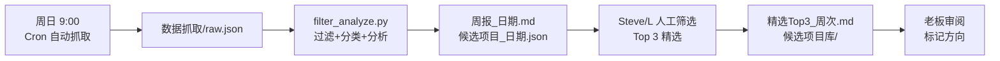

# 09_开源商机 — 开源商机监控系统

> 从 GitHub Trending / Product Hunt / Hacker News Show HN 发现商业化机会
> 自动化数据抓取（每周日 9:00 CST）+ 人工精选 Top 3

---

## 目录结构

```
09_开源商机/
├── 开源商机数据库.md          # Obsidian base 数据库（索引+过滤规则+分析模板）
├── README.md                  # 本文件
├── 脚本/
│   └── filter_analyze.py      # Python 过滤+分类+分析引擎
├── 数据抓取/                  # 每周原始 JSON 数据
│   └── YYYY-MM-DD_raw.json
├── 周报归档/                  # 每周自动生成 + 人工精选
│   ├── 周报_YYYY-MM-DD.md     # 自动生成的完整候选列表
│   ├── 精选Top3_YYYY-Www.md   # 人工精选 Top 3
│   └── 候选项目_YYYY-MM-DD.json
└── 候选项目库/                # 入选候选项目的独立笔记
    └── {项目名}.md
```

## 工作流



## 数据源

| 数据源 | 频率 | 抓取方式 |
|--------|------|----------|
| GitHub Trending | 每周 | web_search + web_extract |
| Product Hunt 周榜 | 每周 | web_search + web_extract |
| Hacker News Show HN | 每周 | web_search + web_extract |

## 过滤规则

| ✅ 保留 | ❌ 排除 |
|---------|---------|
| AI+垂直场景（金融/健康/教育） | 编程语言/框架 |
| SaaS 替代品 | 论文复现 |
| 非开发者工具 | 纯 CLI 工具 |
| 数据/可视化 | 面向开发者的 infra |
| 内容创作工具 | 开发者工具/IDE |
| 生产力/消费者工具 | |

## 分析维度

每个候选项目按 4 个维度分析：

1. **❓ 问题验证**: 它解决了什么人的什么问题？
2. **💰 商业可行性**: 用户愿意付多少钱？
3. **🚀 MVP 可行性**: 能否 1 周内做出更简单的收费版？
4. **🏢 竞品格局**: 已有竞品是谁，怎么收费？

## 负责人

- **数据抓取**: Steve（Cron 自动化）
- **初筛过滤**: filter_analyze.py（自动化）
- **Top 3 精选**: L + Steve（人工）
- **最终决策**: 老板

## 关联

- [[开源商机数据库]] — Obsidian 索引
- [[../05_想法草稿/想法草稿索引|想法草稿]]
- [[../08_决策/决策索引|战略决策]]
